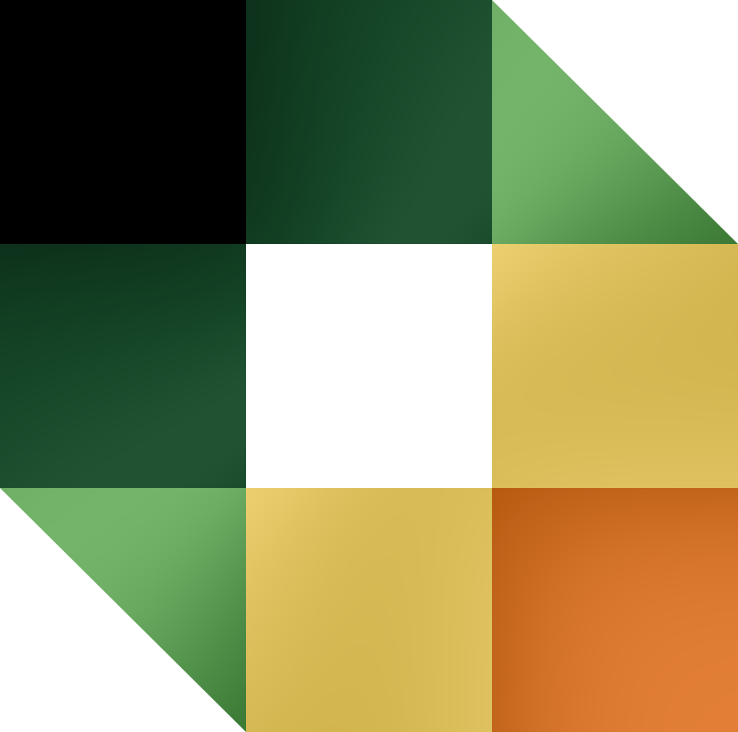
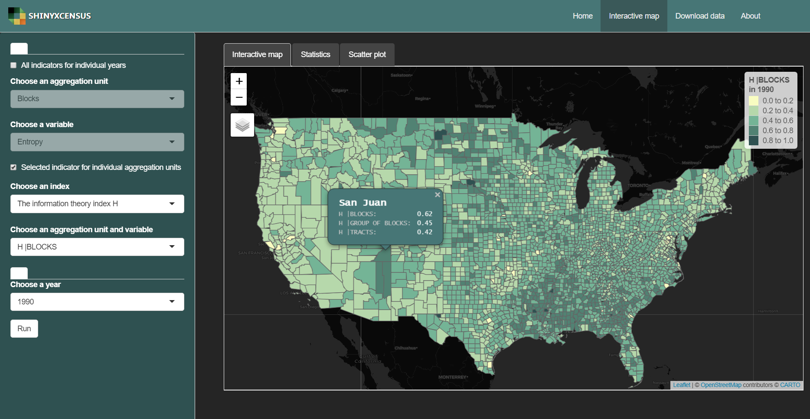
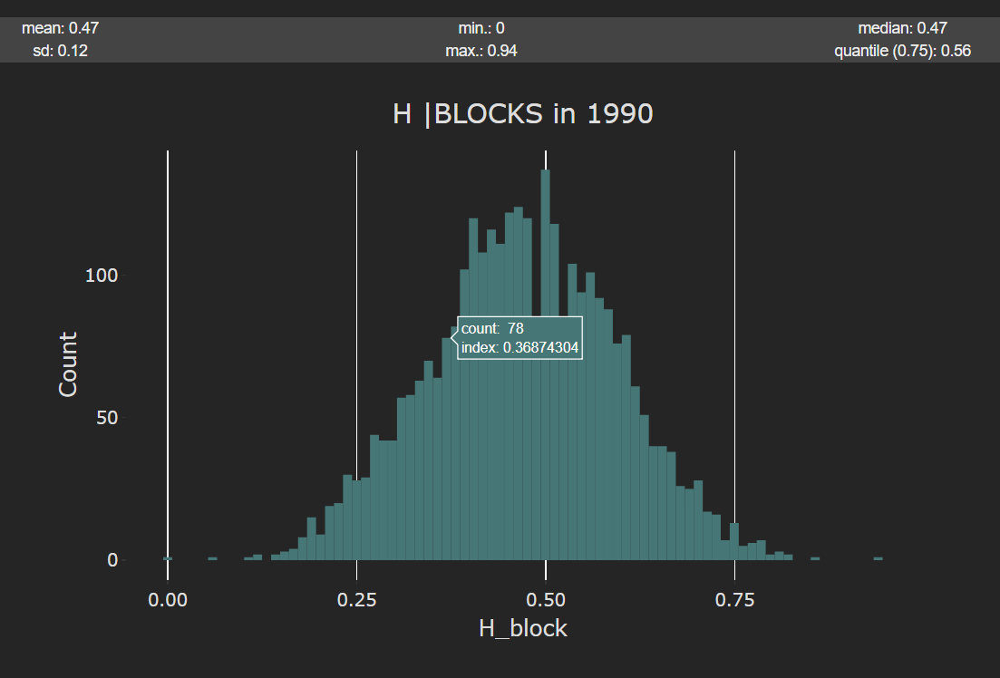
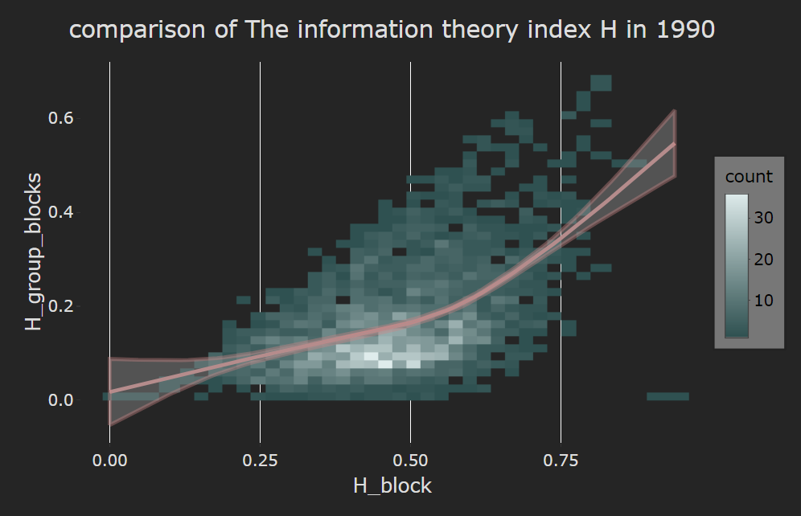
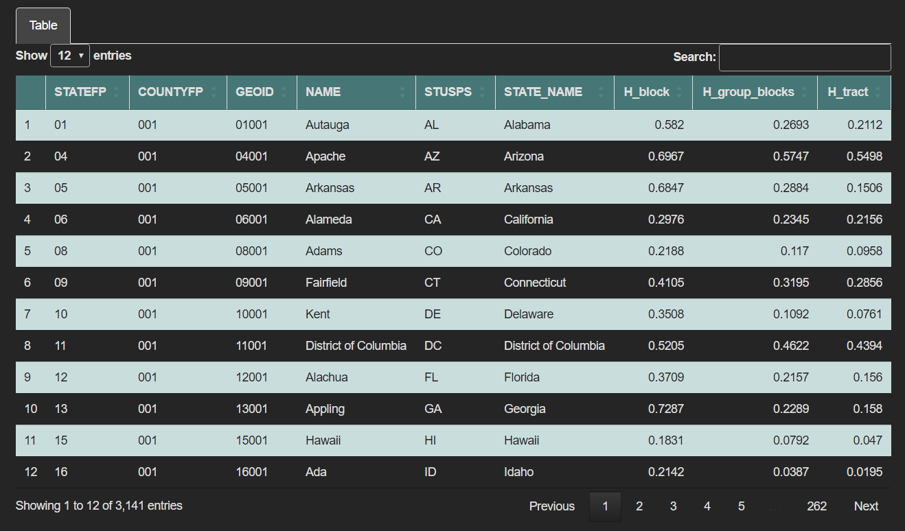

# shinyxcensus


### *App for comparing racial segregation and divirsity measures for different sizes of aggregation units*
https://adryanqe.shinyapps.io/shinyxcensus/
<br />

## Table of contents
* [About](#about)
* [Features](#features)
* [Setup](#setup)
* [Tech](#tech)


<br />

## About
&nbsp;&nbsp;&nbsp;&nbsp;&nbsp;&nbsp;&nbsp;&nbsp; The aim of the app was to visualize and share a database containing racial segregation and diversity metrics calculated for each county in the USA for the years: **$\textcolor{lightgreen}{1990,\ 2000,\ 2010\ and\ 2020}$**.


&nbsp;&nbsp;&nbsp;&nbsp;&nbsp;&nbsp;&nbsp;&nbsp; These metrics were calculated for 3 levels of aggregation units: **$\textcolor{lightgreen}{census\ blocks,\ blocks\ groups\ and\ census\ tracts}$**. The app allows to view county spatial data combined with the resulting tabular data. It enables visualization of data in the form of an interactive map, interactive charts and a table. This app also allows to download resulted data in tabular and spatial form.


&nbsp;&nbsp;&nbsp;&nbsp;&nbsp;&nbsp;&nbsp;&nbsp; The ethnoracial composition can be described by two concepts – **$\textcolor{lightgreen}{racial\ diversity\ and\ racial\ segregation}$**. Racial diversity, a concept that describes a measure 
of the relative heterogeneity of the ethnoracial composition of a population in a given area, is measured by **$\textcolor{lightgreen}{entropy}$**. It allows to determine the level
of population mixing in a given area. **$\textcolor{lightgreen}{The\ index\ of\ dissimilarity\ D}$** and **$\textcolor{lightgreen}{the\ information\ theory\ index\ H}$** make it 
possible to determine racial segregation, i.e. a measure of the spatial distribution of two or more groups living separately from each other in different parts of the 
entire area. The concepts of racial diversity and racial segregation are summarized in a variety of measures, but these are the most widely used. Their use gives the opportunity to learn about the trend of changes in the racial and ethnic diversity of the society for 
the study areas and allows to assess how this situation may change in the coming years.

&nbsp;&nbsp;&nbsp;&nbsp;&nbsp;&nbsp;&nbsp;&nbsp; The values of segregation metrics depend on the adopted division into aggregation units. These measures compare the racial structure of an individual with the 
racial structure of the entire area. Smaller units are more racially and ethnically homogeneous, and therefore their structure differs from that of the entire area. 
As a result, the value of the segregation index decreases with the size of aggregation units. For census areas that are divided into census block groups and census 
blocks, these values are the smallest. This means that, given a larger aggregation unit, there is a less even distribution of racial and ethnic groups within its 
area.

<br />

## Features
* **visualization of calculated metrics in the form of an interactive map**



<br />

* **statistics and a histogram of values**



<br />

* **scatter plot of the metric values for two sizes of aggregation units in the selected year**



<br />

* **table with the possibility of downloading in .csv and .gpkg format**



<br />

## Setup

```
install.packages(c("shiny", "dplyr", "sf", "tmap", 
                   "DT", "shinyjs", "shinyWidgets", "ggplot2", "plotly"))
                   
library(shiny)
runGitHub("shinyxcensus", "Adrian-Nowacki", subdir = "app/")
```

## Tech

* ***shiny*** – creates interactive applications
* ***dplyr*** – manipulates data frames using e.g. filtering, grouping, ordering or combining functions
* ***sf*** – handles spatial data through (setting a coordinate system, reading and writing files, or working on geometry)
* ***tmap*** – visualizes spatial data in the form of all kinds of maps
* ***DT*** – displays data frames and matrixes in the form of interactive tables, with the possibility of sorting, filtering or searching
* ***shinyjs*** – enables the implementation of operations from the JavaScript language in order to improve the application with particular functions
* ***shinyWidgets*** - provides sets of custom widgets for improving the application interface
* ***ggplot2*** – allows to visualize data using charts
* ***plotly*** – creates interactive plots


